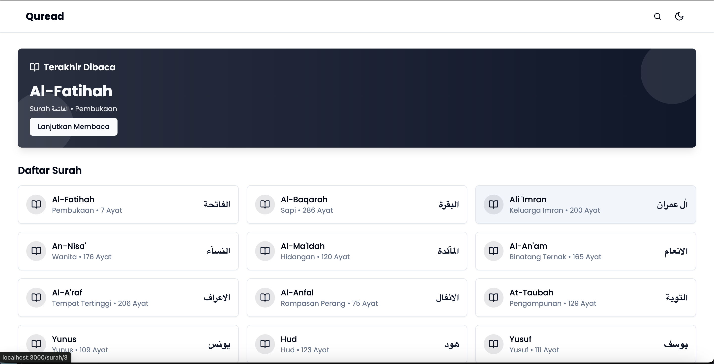
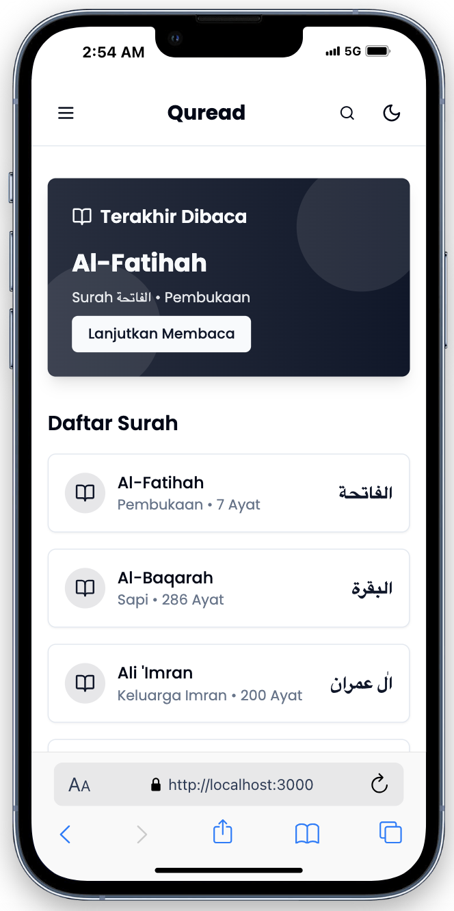

# Quread



**Quread** adalah aplikasi web untuk membaca Al-Qur’an secara nyaman, responsif, dan modern. Dirancang dengan gaya minimalis dan pengalaman pengguna yang tenang, Quread memudahkan siapa pun untuk membaca ayat-ayat suci Al-Qur’an, lengkap dengan terjemahan dan navigasi surah yang intuitif.

## Fitur
- Baca Al-Qur’an secara online dengan teks Arab yang jelas.
- Terjemahan bahasa Indonesia (dan dukungan multibahasa lainnya).
- Navigasi Surah dan Juz yang cepat.
- Pencarian ayat berdasarkan kata kunci.
- Mode gelap dan terang untuk kenyamanan membaca.
- Desain minimalis modern dengan sentuhan spiritual.
- Ringan, responsif, dan mobile friendly.

## Screenshot


## Instalasi & Menjalankan
1. **Clone repo**
   ```bash
   git clone <repo-url>
   cd QuranWeb-React
   ```
2. **Install dependencies**
   ```bash
   npm install
   # atau
   yarn install
   ```
3. **Jalankan aplikasi**
   ```bash
   npm run dev
   # atau
   yarn dev
   ```

## Stack
- React + Vite + Typescript (New)
- TailwindCSS
- shadcn/ui
- Al-Qur’an API (equran.id)

## Lisensi
MIT
